**`reinforo_biblio` =  bibliography on "reinforcement learning for robotics"**

# :dart: scope and ambition

centralize my notes on some works about
- **robotics**
  - here mostly robot arms
- **_learning_** something
  - _learning-based_ as opposed to _hand-crafted_ control
  - mostly `reinforcement learning`
  - :warning: not all papers use _learning_
- **real world**
  - understand the concrete challenges of real-world deployment

---
---


# :mechanical_arm: :mechanical_arm: sim2real - big projects

**`"Learning agile and dynamic motor skills for legged robots"`**

- **[** `2019` **]**
  **[[:memo:](https://arxiv.org/abs/1901.08652)]**
  **[[🎞️](https://www.youtube.com/watch?v=aTDkYFZFWug)]**
  **[[🎞️](https://www.youtube.com/watch?v=Afi17BnSuBM)]**
  **[[:octocat:️](https://github.com/junja94/anymal_science_robotics_supplementary)]**
- **[** _`actuator-net`, `curriculum factors`, `quadrupedal system`, `elastic actuators`, `sim2real`, `randomization`_ **]**

<details>
  <summary>Click to expand</summary>

| 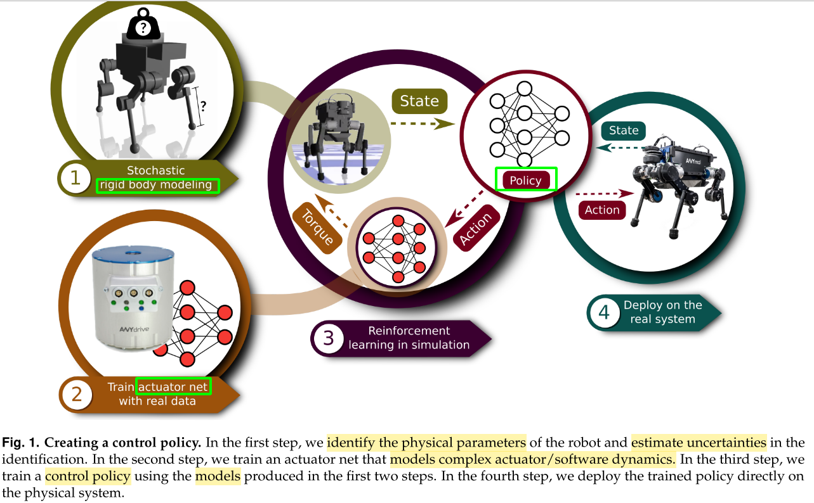 | 
|:--:| 
| *__agent__: `state`-to-`action`. **actuator-net**: `action`-to-`torque`. **rigid-body sim**: `torque`-to-`state` [source](https://arxiv.org/abs/1901.08652)* |

| 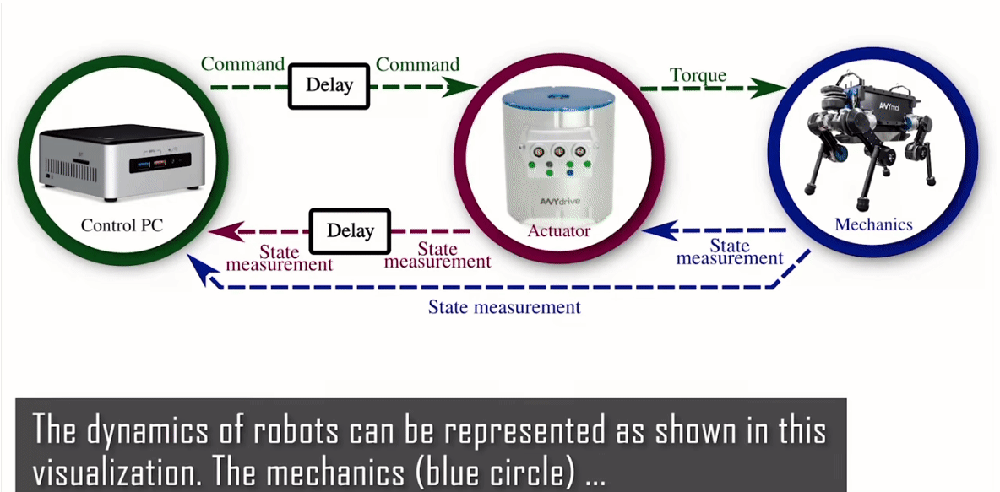 | 
|:--:| 
| *using a `actuator-net` in the simulator [source](https://www.youtube.com/watch?v=aTDkYFZFWug)* |

|  | 
|:--:| 
| *`command`-conditioned task [source](https://www.youtube.com/watch?v=aTDkYFZFWug)* |

|  | 
|:--:| 
| *`recovery from a fall` task [source](https://www.youtube.com/watch?v=aTDkYFZFWug)* |

| 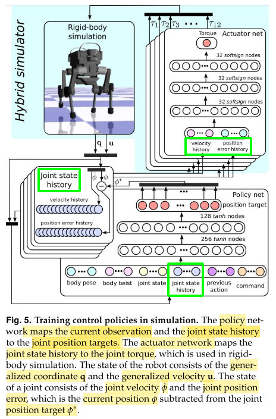 | 
|:--:| 
| *[source](https://arxiv.org/abs/1901.08652)* |

| 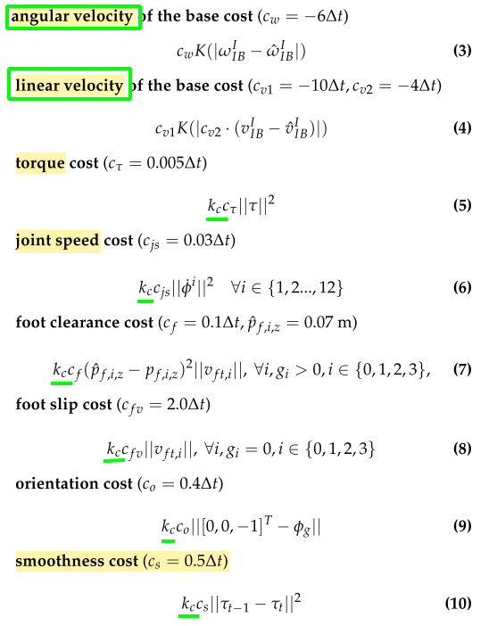 | 
|:--:| 
| *`reward` (here `cost`) terms for the __`command`-conditioned task__. The __`kc` curriculum factors__ apply on the __constraints__ (not the __main objective__) terms and increase during training from `0` to `1` [source](https://arxiv.org/abs/1901.08652)* |

initial questions
- input / output of policy?
- input / output of actuator-net?
- difference with 6/7-dof arm?
- predicting torques or ref-joint-poses?
- what data is collected for training the actuator-net?
- is `history` needed for both `actuator net` and `policy`? how long?

idea:
- train a **`RL` agent** in a **simulator**
  - agent: `state`-to-`action`
  - (sim 1/2) actuator-net: `action`-to-`torque`
  - (sim 2/2) rigid-body sim: `torque`-to-`state`
- `action` = desired `joint positions`

real hardware
- `32 kg`
- `55 cm` long legs
  - > "`ANYmal` has a much **larger leg length relative to footprint**, making it more dynamic, less statically stable, and therefore more difficult to control"
- `3` actuated DOF -> **`12` joins**
  - **hip** abduction/adduction
  - **hip** flexion/extension
  - **knee** flexion/extension
- **`12` Series-Elastic Actuators** (`SEA`)
  - **electric motor** -> gear reduction -> **elastic element** -> load
- actuation chain: **from `position command` (`action`) to `joint torque`**
  - a **`PD`-controller** converts [`position command`] to [`desired torque`]
    - [_as for_ **_nvidia orbit_**](https://github.com/NVIDIA-Omniverse/Orbit/issues/49)
    - the policy network outputs a `joint position` references, which are converted to `torque` using fixed gains (`kP` and `kD`)
  - a `PID`-controller converts [`desired torque`] to [`desired current`]
  - a Field-Oriented Controller (`FOC`) converts [`desired current`] to [`phase voltage`]
  - this voltage produces the `torque` at the **input of the transmission**
  - the deflection of **elastic element** transfers [`torque` from the output of the transmission] to [`torque` at the **joint**]
- **`policy` frequency**
  - `200 Hz` for `command-conditioned locomotion` / `high-speed locomotion`
  - `100 Hz` for `recovery from a fall`

`RL` sim
- two parts:
  - a **rigid-body simulation** (with `fast contact solver`)
    - in: **joint `torques`**
    - in: current robot `state`
    - out: next `state` (`position` and `velocities`)
    - one challenge: dynamics at intermittent contacts
    - one challenge: **system identification** (`mass`, `dimension` ...). Sol: **parameter randomization**
  - `12` **actuator nets**
    - in: history of **`joint position` errors** (using the `joint position` targets (`action`))
    - in: history of `joint velocities`
    - out: `12` joint `torque` values
- `500k` `time-steps / sec`
  - half `rigid-body-sim` / `half actuator-net`

two general approaches to **bridging the reality gap** (in practice, both)
- `1-` improve simulation **fidelity**
  - either analytically (hard and extremely laborious)
  - or in a data-driven way (`system identification`)
- `2-` **accept the imperfections** of simulation and aim to make the **controller robust** to variations in system properties
  - **randomization**of the simulation: **stochastic policy**, randomizing the **dynamics**, adding **noise to the `observations`**, and **perturbing the system** with **random disturbances**
  - training with **`30` different `ANYmal` models**
    - stochastically sampled **inertial properties**: `center of mass` positions, `masses of links`, `joint positions`

modelling `SEA` is difficult:
- the **actuator dynamics** (especially with **elastics**)
- the `delays` in **control signals** introduced by multiple hardware and software layers
  - > "a complex sensor suite and multiple layers of software bring `noise` and `delays` to information transfer"
  - > "the ideal actuator model assumes that there is **no communication `delay`** and that the actuator can generate any commanded torque **instantly**"
- the low-level **controller dynamics**
- the compliance/damping at the joints

_ - _ - _

actuator-net: **data-collection**
- _what is collected?_
  - `joint position` **errors**
    - `error = actual - desired`
  - `joint velocities`
  - `torques`
  - current `state`
  - history: **last `2` `states`** (`t−0.01` and `t−0.02` sec)
    - how dense/sparse, how far in the past?
    - **tuned** wrt. the **validation error**
- _how is it collected?_
  - **foot trajectories** in the form of a **sine wave**
    - with parameterized controller and **inverse kinematics**
  - the feet constantly **made or break a contact** with the ground
  - **amplitude** in (`5∼10 cm`)
  - **frequency** in (`1∼25 Hz`)
  - **the robot is manually disturbed** during data collection. _how exactly?_
- more than a **million samples**, in `4 min` (at `400 Hz` using the `12` actuators)

actuator-net: training
- `MLP` with `3` hidden layers
  - `32` + `32` + `32`
- the **non-linearity** has a strong effect on performance on the physical system
  - **bounded** activation functions, such as `tanh,` yield **less aggressive trajectories** when **subjected to disturbances**
    - > "**unbounded** activation functions, such as `ReLU`, can **degrade** performance on the real robot, since actions can have **very high magnitude when the robot reaches states that were not visited** during training."
  - [**`softsign` activation function**]():
    - like `sigmoid`, but **(-1, 1)**, and **zero-centred**
    - like `tanh`, but converges **polynomially** (not exponentially)
    - `12.2 µs` with `softsign`
    - `31.6 µs` with `tanh`
- **error** on the **validation** set: `0.74 Nm`
- **error** on the **test** set: `0.96 Nm`
- resolution of the `torque` measurement: `0.2 Nm`

`observation` noise
- `joint velocities` cannot be directly measured on the real robot
  - estimate: **numerically differentiation** of the `position` signal
  - imperfection modelling: a strong noise (`U(−0.5, 0.5) rad/s`) to the `joint velocity` measurements during training
- **noise** added during training to:
  - the **observed linear velocity** (`U(−0.08, 0.08) m/s`)
  - the **angular velocity** (`U(−0.16, 0.16) m/s`) of the base

`dynamics` noise
- not mentioned here, but in [`ANYmal` in `Omniverse`](https://www.youtube.com/watch?v=Afi17BnSuBM) the robot it pushed
  - this **force it to learn robust gaits**

_ - _ - _

policy: a **`joint position` policy** (not `torque`)
- we use the **policy network** as an **`impedance` controller**
  - > "Simpler control methods, such as `position control` or `torque control`, **perform poorly** when the manipulator experiences **contacts**. Thus, **[`impedance control`](https://en.wikipedia.org/wiki/Impedance_control)** is commonly used in these settings."
- out: `actions` are the **low-`impedance` joint position** commands
  - [`mechanical impedance`](https://en.wikipedia.org/wiki/Impedance_control) = `force output` / `motion input`
  - > "If we control the `impedance` of a mechanism, we are controlling the **`force` of resistance** to external motions that are imposed by the environment"
- > "a `position` policy has an advantage (over `torque`) in training since it starts as a **standing controller** whereas a `torque` controller initially creates many trajectories that result in falling. Thus, we use the `policy` network as an `impedance` controller."

`MDP`.`task`
- locomotion, given target `X-Y velocity` and `yaw rate`
- recovery from a fall

`MDP`.`action`
- `joint position` target for the `12` joints

`MDP`.`observation`
  - **history** of the robot's states (`joint velocities` and **`joint position` errors**)
    - _how old?_ sampled at `tk − 0.01 s` and `tk − 0.02 s`
    - very important to **detect contacts**
  - current robot's `state` (`joint velocities` and `joint position`)
  - **previous `action`** (_only one?_)
  - **body** state (`pose`, `twist` and `speed`)
  - **`command`**
  - removing the `velocity` makes the **training fail**
    - > "even though in theory the `policy` network could infer `velocities` as finite differences of observed `positions`"
    - **input normalization** is necessary in most learning procedures

`MDP`.**commands**
- three components:
  - `forward velocity`
  - `lateral velocity`
  - `yaw rate`
- part of the `observation`

`MDP`.`reward`
- complex!
- **curriculum factor** (`kc`)
  - `r` = `r_objective` + `kc_1` * `r_contraint_1` + `kc_2` * `r_contraint_2` + `...`
  - `kc_i` increases from `0` to `1`
  - > "This way, the robot **first** learns **how to achieve the `objective`** and **then** how to **respect various `constraints`**."
  - > "Instead of altering the `samples`, we **alter the `objective`** to control the training difficult"
- note that many `cost` terms are also **multiplied by the time step `∆t`** since we are interested in the **integrated value over time**
  - _strange_

`MDP`.`gamma`
- hyper-param **tuning**
- we used `γ` = `0.9988` which corresponds to a **half-life of `5.77 s`**
  - `γ^n=exp(n*ln(γ))=0.5` for `n=ln(0.5)/ln(γ)=557`
- depends on the timestep
  - _with `dt=0.01`, `n*dt=5.77`_

`MDP`.`termination`
- _`truncation`?_ after **`6` seconds**
- `termination` (`r=-1`): violating **joint limits**
- `termination` (`r=-1`): hitting the ground with the base

`policy` net
- light `MLP`
  - `2` hidden layers (`256` + `128`)
  - **`25 µs` inference** on a single CPU thread

_ - _ - _

performance
- **high speed** motion (**learnt gait** pattern: **trot** with full flight phase)
- fast and flexible **recovery after a fall**
- fewer engineering / expertise than full-modelling
- **fast inference**
- energy-efficiency

differences from [`ANYmal` in `Omniverse`](https://www.youtube.com/watch?v=Afi17BnSuBM)
- `MDP`.`obs`: also the terrain height
- **game-inspired curriculum**: one single env with different difficulties
  - discover what terrains are hard (instead of decide it)
  - the terrain is not re-generated
- `rigid-body sim`: randomize friction coefficient
- `rigid-body sim`: push
- `actuator net`: LSTM

</details>

---

**`"Learning Dexterous In-Hand Manipulation"`**

- **[** `2019` **]**
  **[[:memo:](https://arxiv.org/pdf/1808.00177.pdf)]**
  **[[🎞️](https://openai.com/research/learning-dexterity)]**
  **[[🎞️](https://www.youtube.com/watch?v=6fo5NhnyR8I)]**
- **[** _`openAI`, `randomization`, `RNN`, `privileged learning`, `external pose estimator`_ **]**

<details>
  <summary>Click to expand</summary>

| 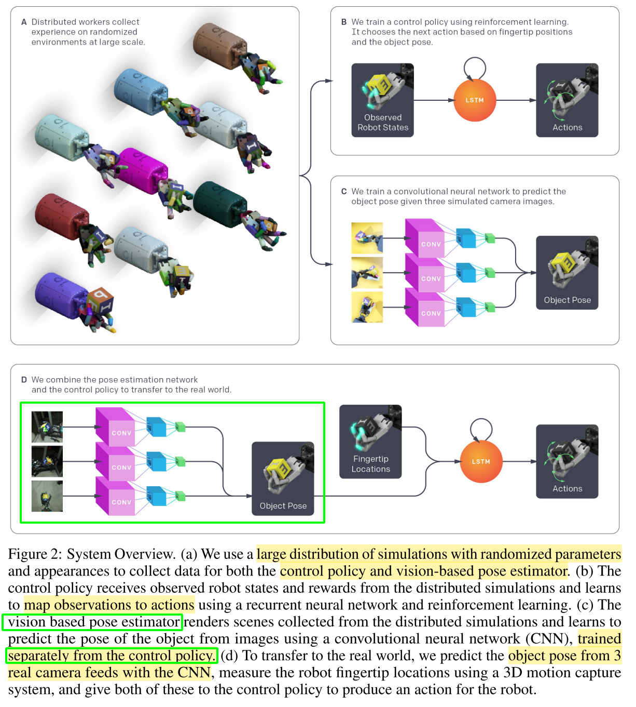 | 
|:--:| 
| *many environments are simulated [source](https://www.youtube.com/watch?v=jwSbzNHGflM)* |

| 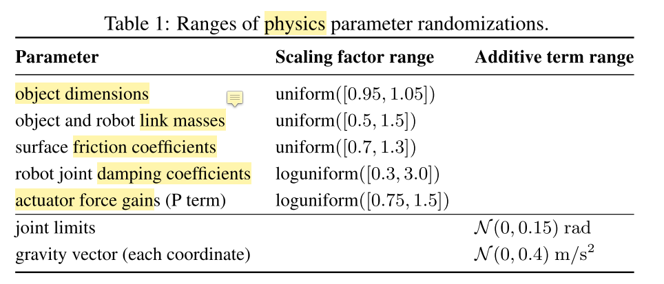 | 
|:--:| 
| *randomization of __`physics` parameters__. Other parameters are randomized, not just `Physics` [source](https://www.youtube.com/watch?v=jwSbzNHGflM)* |

| 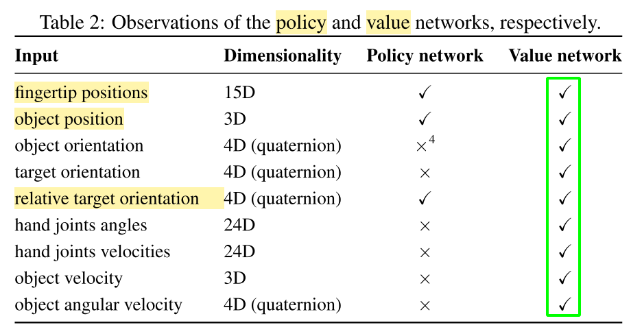 | 
|:--:| 
| *`Asymmetric Actor-Critic`: to make the training easier, the `Value` network can have access to **information that is not available on the real robot system** [source](https://www.youtube.com/watch?v=jwSbzNHGflM)* |

|  | 
|:--:| 
| *a `pose estimator` is learnt to feed the `pose` (not the `image`) to the `policy`. And __internal sensors__ are not used because __hard to model__. [source](https://www.youtube.com/watch?v=jwSbzNHGflM)* |

ideas
- train in **simulated** environments with **randomization** of
  - `dynamics`: physical properties, e.g. **friction coefficients**
  - `observation`: object's appearance
- key ingredients
  - **extensive randomization**
  - `RNN`: **memory-augmented** control polices
    - > "Many of the randomizations we employ **persist across an episode**, and thus it should be possible for a **memory augmented policy** to **identify properties** of the current environment and adapt its own behavior accordingly"
    - `RNN` in both the `policy` and `value` function
    - `LSTM` state is **predictive of the environment randomization**
  - **distributed `RL`**

control policy
- `obs`
  - cube pose
  - fingertips locations
  - sensors in real world
    - (markers) 16 PhaseSpace tracking cameras
    - (vision) 3 Basler RGB cameras
      - 3 cameras to resolve pose ambiguities that may occur with monocular vision
    - > "we do not use the **touch sensors** embedded in the hand"
      - because they are subject to **`state`-dependent noise** that would have been **difficult to model** in the simulator
- `action`
  - desired `joints angles` relative to the current ones
  - [`24`-DoF `5`-finger Hand](https://www.shadowrobot.com/dexterous-hand-series/)
  - `action` discretized into **`11` bins**
    - > "While `PPO` can handle both `continuous` and `discrete` action spaces, we noticed that **`discrete` `action` spaces** work much better"
- `reward`
  - error in `rotation angles`
  - bonus if success
  - penalty if cube falls
- `dt`
  - forward path in NN: `25ms` 
  - > "We update the targets of the `low`-level controller, which runs at roughly **`1` kHz**, with **relative positions** given by the `control policy` at roughly **`12` Hz**"
  - > "Each environment step corresponds to **`80 ms` of real time** and consists of **`10` consecutive `MuJoCo` steps**, each corresponding to `8 ms`"

**pose estimator**
- a pre-trained **encoder** of the `observation`
- **trained separately** from the `control policy`
- in: 3 cam images
- out: `position` and `orientation`

simulator
- MuJoCo
- Unity for rendering
- the model of the Hand is improved using calibration

[`Rapid`]()
- `PPO` scales up easily and requires **little hyperparameter tuning**
- > The vast majority of training time is spent **making the policy robust** to different physical dynamics
  - one domain: 3 years
  - all domains: 100 years of experience

**privileged** learning
- in `PPO`, the `value` network is **only used during training**
- `Asymmetric Actor-Critic`: value network can have access to **information that is not available on the real robot system**, to make the training easier

**reality gap**
- no **`tendon`-based actuation**
  - rather `torque` applied to `joints`
- no **deformable body contact** models
  - rather **rigid body contact** models 

randomization
- `Observation` noise
  - Gaussian noise to `policy` `obs`
  - > "we apply a `correlated noise` which is sampled **once per episode** as well as an `uncorrelated noise` sampled at **every timestep**"
- Physics randomization
  - `calibration` = `system identification`
  - sampled at the start of each episode and held fixed
- Unmodeled effects
  - > "To account for **imperfect actuation**, we use a simple model of **motor backlash** and introduce `action delays` and `action noise` before applying them in simulation"
  - against short-time **loss of tracking** and marker **occlusion**
    - **freezing the `position`** of a simulated marker with low probability for a short period of time in simulation
  - > "To handle additional unmodeled dynamics, we apply **small random forces** to the object"
- Visual appearance randomization
  - camera positions and intrinsics
  - the pose of the hand and object
  - lighting, materials and textures

</details>

---
---

# :mechanical_arm: sim2real - small projects

**`"Sim-to-Real Transfer of Robotic Control with Dynamics Randomization"`**

- **[** `2018` **]**
  **[[:memo:](https://arxiv.org/pdf/1710.06537.pdf)]**
  **[[🎞️](https://www.youtube.com/watch?v=XUW0cnvqbwM)]**
- **[** _`domain randomization`, `pushing task`, `privileged learninig`, `RNN`_ **]**

<details>
  <summary>Click to expand</summary>

| 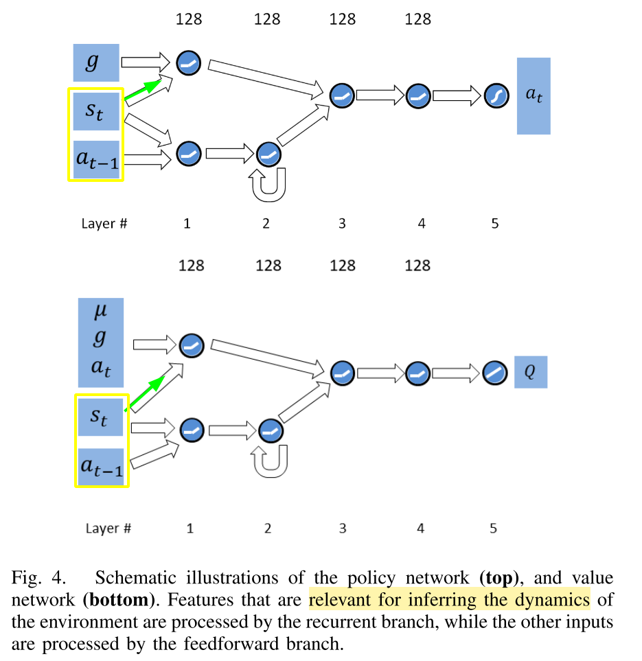 | 
|:--:| 
| *only with information required to **infer the `dynamics`** are passed to the `LSTM` unit. Since the current `state` (`st`) is of particular importance for determining the appropriate `action` for the current timestep, a copy is also provided as input to the __feedforward__ branch [source](https://arxiv.org/pdf/1710.06537.pdf)* |

| 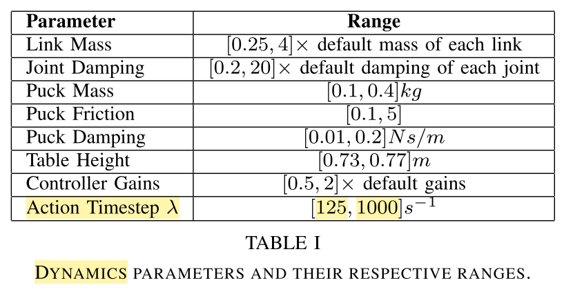 | 
|:--:| 
| *randomized `dynamics` parameters [source](https://arxiv.org/pdf/1710.06537.pdf)* |

| 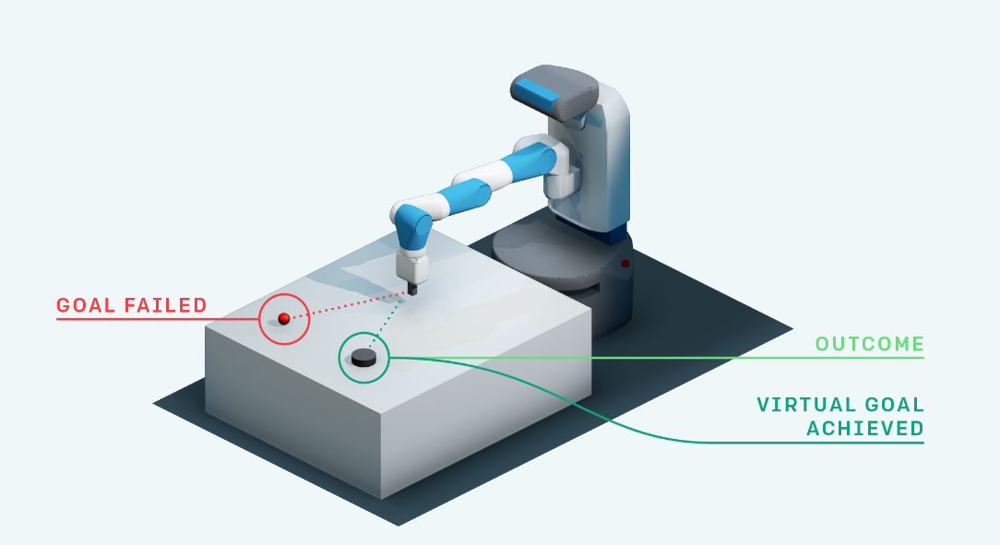 | 
|:--:| 
| *Hindsight Experience Replay (`HER`): instead of considering the **trajectory as a failure** wrt. the current `goal`, it can be seen as a **success** for a different `goal` - which is valuable to learn [source](https://github.com/sudharsan13296/Hands-On-Reinforcement-Learning-With-Python)* |

| 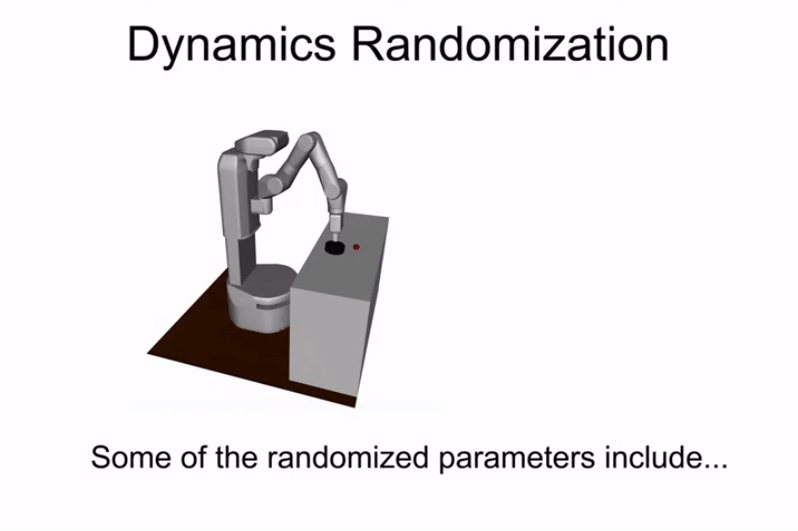 | 
|:--:| 
| *`95` parameters are randomized. Some at each `action` step, some at each `episode` [source](https://www.youtube.com/watch?v=XUW0cnvqbwM)* |

|  | 
|:--:| 
| *the system is robust to changes in contact `dynamics` (a packet of chips is attached to the bottom of the puck) [source](https://www.youtube.com/watch?v=XUW0cnvqbwM)* |

ideas
- **low fidelity** simulator and **poor calibration / `SysID`** can be enough to fully learn in `sim` and successfully deploy into `real`
- the `policy` is trained to adapt to a **wide-range of randomized environments** - hopefully it learns to adapt to yet another `env`: the **real `env`**.
- ingredients to **prevent over-fitting** and enable transfer
  - randomizing the `dynamics`
  - adding noise to `observations`
  - coping with the **latency of the controller**
- > "With **domain randomization**, discrepancies between the `source` and `target` domains are modeled as **variability in the `source` domain**"

task: **pushing**
- > "pushing, a form of _**non-prehensile**_ manipulation, is an effective strategy for positioning and orienting objects that are too large or heavy to be grasped"
- challenge: modeling the complex **contact dynamics** between surfaces

hardware
- tested on `7`-DOF [`Fetch Robotics`](https://fetchrobotics.com/) arm
- the location of the puck is tracked using the [`PhaseSpace mocap`](https://www.phasespace.com/x2e-motion-capture/) system.

`time` concepts in `MuJoCo` simulator
- one episode = `100` **_control_** (`action`) steps
- one _simulation_ timestep = `0.002s`
- one _control_ timestep = `action duration` = multiple _simulation_ steps
  - by default `20` _simulation_ steps = `dt0`
- _how to **model the `latency`** of the real robot?_
- **`action duration`** = `dt0 + eps`
  - `eps` is sampled at **each step** from `exp(λ)`, with `λ` sampled at **each episode** from `[125, 1000] s−1` 
- hence one **episode duration** = `100 * ~20 * 0.002` = `~4s`

`MDP` formulation
- `52`d `state` space:
  - **arm joints**: positions, velocities
  - **gripper**: position 
  - **puck**: position, orientation, linear and angular velocities
- `7`d `action` space:
  - > "`actions` from the `policy` specify **target joint angles** for a `position controller`. Target angles are specified as **relative offsets** from the current joint rotations"
  - _question: why caring about the `duration` between two `actions`? do they just wait for the move to finish between querying the agent for the next `action`?_ 
    - > "The timestep between `actions` specifies the amount of time an **`action` is applied** before the policy is queried again to sample a new `action`. This serves as a simple model of the **latency** exhibited by the physical controller."
    - _ok, I would understand if the `action` were a `torque`: the longer it is applied, the larger the changes. But with a target offset as `action`, the impact of the `action duration` does not make much sense to me, unless if the control is not blocking and can be interrupted/truncated._
- **sparse** `rewards`
  - > "designing a **dense** `reward` function can be challenging for more complex tasks, and may **bias the policy towards adopting less optimal behaviours**"
  - the sparse `rewards` let the agent develops **clever strategies**
    - > "these behaviours **emerged naturally** from the learning process using **only a _sparse binary_ `reward`**"

benefits of **`RNN`** (both in `Value` and `Policy`)
- in the absence of direct knowledge of the parameters, the **`dynamics` can be inferred from a history** of past `states` and `actions`
  - either: try to **explicitly identify** the parameters
  - or: `SysID` can be **implicitly embedded** into a `policy`
    - using a **recurrent** model `π(at|st, zt, g)`
    - the **internal memory `zt = z(ht)` acts as a summary of past `states` and `actions`**, thereby providing a mechanism with which the policy can use to **infer the dynamics** of the system.
- do not pass **all info** to the recurrent unit
  - the **goal location `g`** does not hold any information regarding the `dynamics` of the system: therefore processed only by the feedforward branch.
- trained with `Recurrent DPG` (`RDPG`)
- **stacking** is **simpler** and not much worse
  - **history of the `8` previously observed `states` and `actions`**
  - `FeedForw + Hist` achieves `87%` success in `sim` against `91%` for the `LSTM`

**_omniscient_ critic** for **training efficiency**
- similar to "privileged learninig" or [`Asymmetric Actor-Critic`](https://arxiv.org/abs/1710.06542)
- the **`dynamics` parameters `µ`** are passed to the `Value function` receives as input, but not to the `policy`
  - the `Value function` is used only during training, when `dynamics` parameters of the simulator are known
  - this allow the `Value function` to provide more meaningful feedback for improving the policy

**`HER` = Hindsight Experience Replay**
- idea: instead of considering a **trajectory as a failure** for the current `goal`, it can be **considered it a success for a different `goal`**
- **`HER` augments** the original training data recorded from rollouts of the policy **with additional data generated** from **replayed `goals`**, it requires **off-policy** learning

**randomization**
- _when?_
  - either at the **start of each episode**
    - > "a random set of **`dynamics` parameters** `µ` are sampled according to `ρµ` and held fixed for the duration of the episode"
  - or at **each step**
    - e.g. `action duration`, `observation noise`, `action` exploration noise
- `95` randomized parameters
  - **Mass** of each link in the robot’s body
  - logarithmically sampled:
  - Damping of each joint
  - Mass, friction, and damping of the puck
  - Height of the table
  - Gains for the position controller
  - Timestep between actions
  - Observation noise
    - independent Gaussian noise applied to each state feature
    - **standard deviation** = **`5%` of the running std** of each feature
- > "Parameters such as `mass`, `damping`, `friction`, and controller `gains` are **logarithmically sampled**, while other parameters are **uniformly sampled**"
- > "Gaussian **`action` exploration noise** is added at every step with a standard deviation of `0.01 rad`"

**system identification (`SysID`)**
- often require **meticulous calibration** of the simulation to closely conform to the physical system
- sometimes just impossible
- here: the policies are able to adapt to significant **calibration error**.

"universal" `policy`
- `policy` and `rewards` are conditioned on the target (`goal` noted `g`)

</details>

---

**`"Closing the sim-to-real Loop: Adapting simulation randomization with real world experience"`**

- **[** `2019` **]**
  **[[:memo:](https://arxiv.org/abs/1810.05687)]**
  **[[🎞️](https://www.youtube.com/watch?v=nilcJY5Kdt8)]**
  **[[🎞️](https://sites.google.com/view/simopt)]**
- **[** _`sim2real`, `domain randomization`, `simulation parameter distribution`, `franka emika`_ **]**

<details>
  <summary>Click to expand</summary>

| 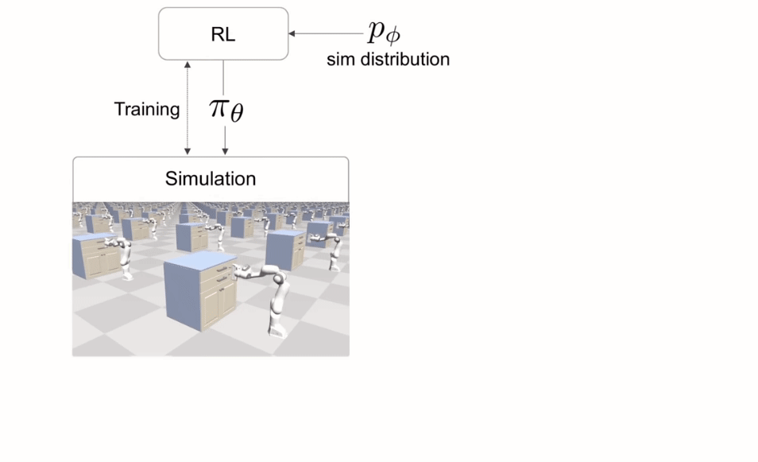 | 
|:--:| 
| *iterations: set params, learn a `pi` in `sim`, collect (few) samples using this `pi` in real world, compare `real` and `sim` samples, adjust params, etc. [source](https://www.youtube.com/watch?v=OXzR_5TJ7Xk)* |

|  | 
|:--:| 
| *it is often disadvantageous to use __overly wide distributions__ of simulation parameters as they can include scenarios with __infeasible solutions__ [source](https://www.youtube.com/watch?v=OXzR_5TJ7Xk)* |

|  | 
|:--:| 
| *updating the parameters of the `simulator parameters distribution` [source](https://www.youtube.com/watch?v=OXzR_5TJ7Xk)* |

|  | 
|:--:| 
| *`swing-peg-in-hole` [source](https://www.youtube.com/watch?v=OXzR_5TJ7Xk)* |

|  | 
|:--:| 
| *`cabinet drawer` [source](https://www.youtube.com/watch?v=OXzR_5TJ7Xk)* |

| 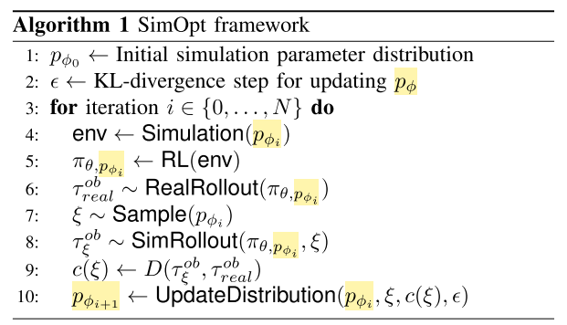 | 
|:--:| 
| *`simulation parameter distribution` is denoted by `Pφ`. To collect simulated `observation` samples, `simulation parameters` (`ξ`) are sampled from `Pφ` [source](https://arxiv.org/abs/1810.05687)* |

| 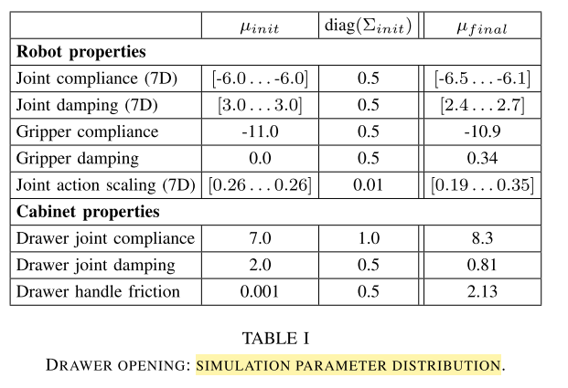 | 
|:--:| 
| *`simulation parameter distribution` [source](https://arxiv.org/abs/1810.05687)* |

| 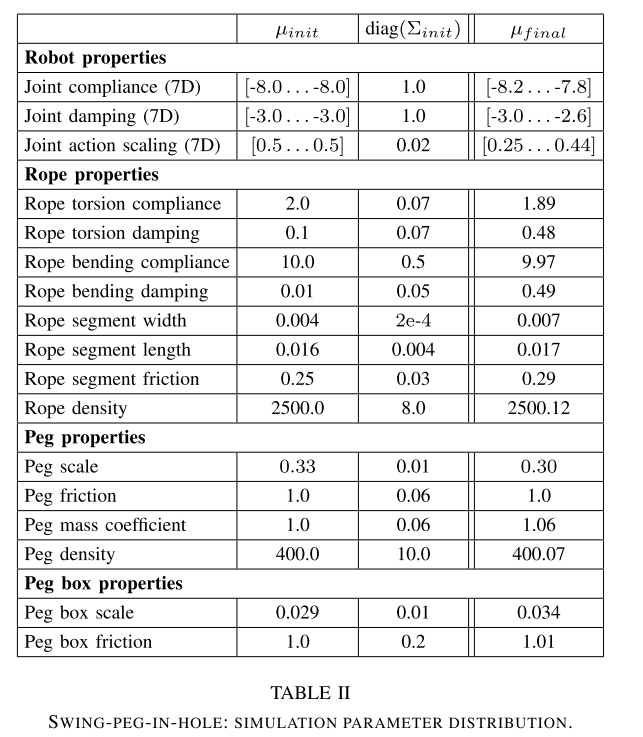 | 
|:--:| 
| *`simulation parameter distribution` [source](https://arxiv.org/abs/1810.05687)* |

motivation
- `domain randomization` requires a **significant expertise** and **tedious manual fine-tuning** to design the `simulation parameter distribution`
- combine `system identification` and `dynamics randomization`

ideas
- **do not manually tune** the randomization of simulations
  - automate the learning of the **`simulation parameter distribution`**

how to update the parameters of the `simulation parameter distribution` (`Pφ`)?
- goal: bring `observations` induced by the `pi`(`Pφ`) closer to the `observations` of the real world
- minimization problem
  - `cost` = `Dist`(`obs-real`, `obs-sim`) 
- > "It should be noted that the **inputs** of the policy `pi`(`θ`, `pφ`) and observations used to compute `D`(`τ-obs`-`ξ` , `τ-obs-real`) are not required to be the same"
  - _but the initial `state` yes? is this open loop?_

real world setting:
- no need for **exact replication** of the **real world environment**
  - no need for `rewards`
  - partial `observations` is fine
- > "we use object tracking with [`DART`](http://www.roboticsproceedings.org/rss10/p30.pdf) to continuously **track the 3D positions** of the peg in the swing-peg-in-hole task"

training iterations
- the RL training can be **sped up** by **initializing the policy** with the weights from the previous `SimOpt` iteration
  - PPO iterations from `200` to `10` after the first `SimOpt` iteration

MDP
- `action`
  - joint velocity (`7-dof`)
  - gripper command
  - _`dt` = ?_
- `swing-peg-in-hole`
  - `obs`
    - joint configurations _???_
    - 3D position of the peg
    - :warning: _the `goal` position (hole) is not observed -> the `policy` is specific to one setting_
  - `reward`
    - distance peg-hole
    - angle alignment with the hole
    - a binary reward for solving the task
  - params
    - peg size
    - rope properties
    - size of the peg box
- `cabinet drawer`
  - `obs` (10 dim)
    - joint angles
    - 3D position of the cabinet drawer handle
  - `reward`
    - distance penalty between the handle and end-effector positions
    - the angle alignment of the end-effector and the drawer handle
    - the opening distance of the drawer
    - an indicator function ensuring that both robot fingers are on the handle
  - params
    - `position.x` of the cabinet

simulator
- > [`FleX`](https://developer.nvidia.com/flex) is a particle based simulation technique for real-time visual effects.
  - _predecessor of `IsaacSim`?_

related works
- > [`EPOpt`](https://arxiv.org/pdf/1610.01283.pdf) ([`video`](https://www.youtube.com/watch?v=w1YJ9vwaoto)) (**ensemble** optimization approach) optimizes a **risk-sensitive objective** to obtain robust policies, whereas we optimize the **average performance** which is a **risk-neutral** objective

</details>

---

**`"Data-efficient Domain Randomizationwith Bayesian Optimization"`**

- **[** `2021` **]**
  **[[:memo:](https://arxiv.org/pdf/2003.02471.pdf)]**
  **[[🎞️](https://www.youtube.com/watch?v=V1KZmIcMLt0)]**
  **[[️:octocat:](https://github.com/famura/SimuRLacra)]**
- **[** _`ball-in-a-cup`, `domain randomization`_ **]**

<details>
  <summary>Click to expand</summary>

| 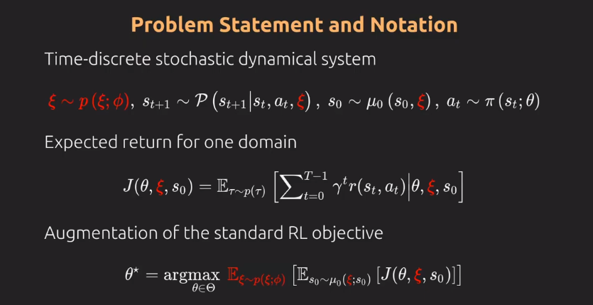 | 
|:--:| 
| *a `dynamic parameter` is introduced, it influences the `initial state` and the `transition` function. The expectation __over all domain parameters__ is to be maximized -> the `policy` should be __robust to shifts__ in the __`domain parameter distribution`__ [source](https://www.youtube.com/watch?v=V1KZmIcMLt0)* |

| 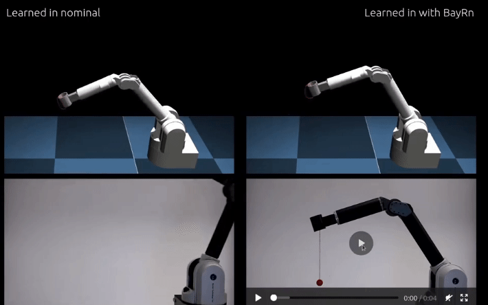 | 
|:--:| 
| *top=training: same __seed__ and __architecture__, the left __exploits the simulator__,  - not transferring, the right uses `BayRn` and is more conservative and robust [source](https://www.youtube.com/watch?v=V1KZmIcMLt0)* |

agents can exploit the simulator / the physics engine
- overfitting to features which do not occur in the real world

how is the `domain parameter distribution` updated?
- based on sparse real-world data
- using bayesian tools (Gaussian Process)

this is not `system identifaction`
- we do not care if the **parameters match the reality**
- instead, we care about the performance in real world

[`SimuRLacra`](https://github.com/famura/SimuRLacra)
- a Python/C++ framework for **RL from randomized physics simulations**

</details>

---

**`"Cyclic Policy Distillation: Sample-Efficient Sim-to-Real Reinforcement Learning with Domain Randomization"`**

- **[** `2022` **]**
  **[[:memo:](https://arxiv.org/abs/2207.14561)]**
- **[** _`domain randomization`, `sim2real`, `policy distillation`_ **]**

<details>
  <summary>Click to expand</summary>

| 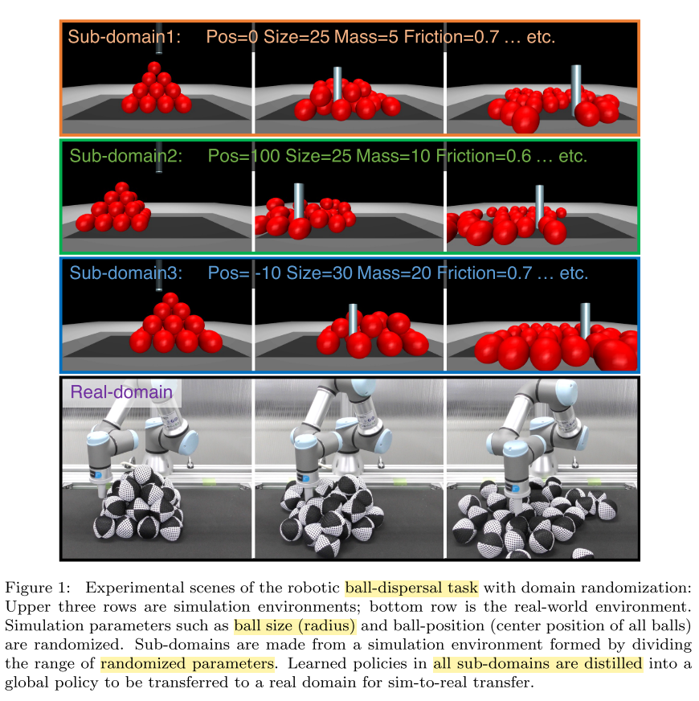 | 
|:--:| 
| *main idea [source](https://arxiv.org/abs/2207.14561)* |

| 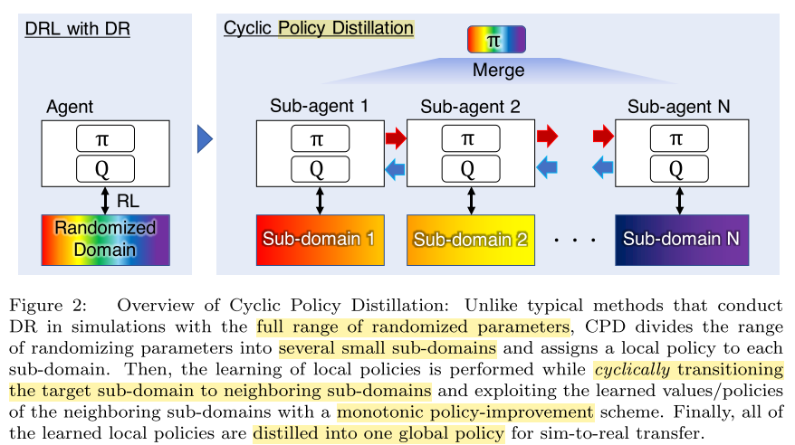 | 
|:--:| 
| *cyclic transitions [source](https://arxiv.org/abs/2207.14561)* |

| 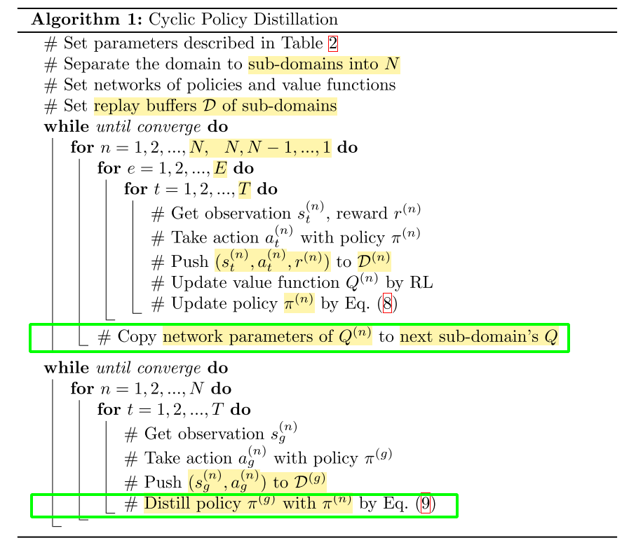 | 
|:--:| 
| *algorithm: the `value function` `Q(n)` of `env.n` is transferred to the __neighbouring environment__. Could a `policy` be transferred instead (making `on-policy` possible)? [source](https://arxiv.org/abs/2207.14561)* |

| 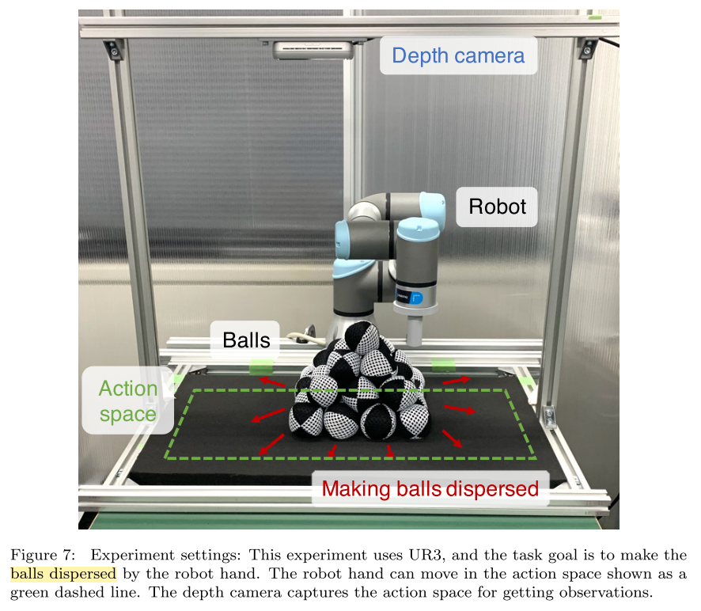 | 
|:--:| 
| *real-world task [source](https://arxiv.org/abs/2207.14561)* |

| 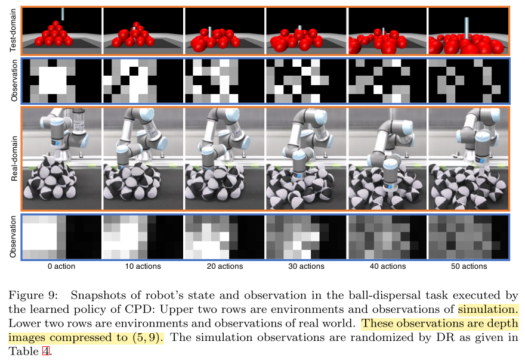 | 
|:--:| 
| *`observation` space [source](https://arxiv.org/abs/2207.14561)* |

| 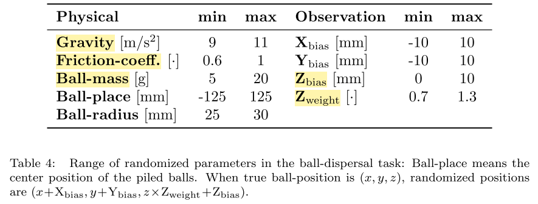 | 
|:--:| 
| *parameters randomized to help domain transfer [source](https://arxiv.org/abs/2207.14561)* |

motivation
- `sim-to-real` (for the `dynamics`, not the `observation`)
- efficient
- stable

idea
- **subdomains** (with varying parameters, e.g. `gravity`, `friction` ...) are **not selected _randomly_**
  - otherwise, the gap of subdomains in distillation can be large, making the learning results **unstable** and sample-inefficient
  - the subdomains with **adjacent index numbers** should be set up so that their **randomization ranges** are **similar**
- wait for all `sub.pi` to converge before distilling into a `global.pi`

"Cyclic Policy Distillation" (`CPD`)
- **"Policy Distillation"**
  - **transfer learned knowledge** between local policies in **divided subdomains**
    - the **dividing number `N`** controls the tradeoff between the **learning stability** and the **sample efficiency**
  - final integration of all local policies into a single **global policy**
    - learn to predict the same `action` distribution given an `observation`
    - `loss` = sum of `KL-div` between [`pi-g(s, a)`] and [`pi-n(s, a)`]
- "Cyclic"
  - transfer knowledge between **_adjacent_ subdomains**

monotonic improvement (`MI`) to update `pi-N`
- `loss` = `loss-RL` + `loss-MI`
  - `loss-MI` = KL-divergence between [`pi-N`] and [a weighted combination of `pi-N` and `pi-N'`]
- weight = `m`
  - `m` = `0` means neighboring local policies are **not exploited** for learning
  - `m` = 1 means neighboring local policies are **copied**

real-world experiment
- no need to model the full robot: **only** the **robot’s fingertip** is simulated
  - because, in the real-world environment, the robot’s kinematics do not affect the task achievement

- parameters
  - `ball-radius`, `gravity`, `friction-coefficient`, `ball-mass`
  - balls move in strange directions when deformed by the robot’s physical interaction

limits
- what simulator??
- `actor critic` methods: `SAC` but not `PPP`
- same task: all domains share the same reward function

</details>

---
---

# :chopsticks: tasks examples

**`"cartpole"`**

- **[[:memo:](https://www.gymlibrary.dev/environments/classic_control/cart_pole/)]**
  **[[:octocat:](https://github.com/openai/gym/blob/master/gym/envs/classic_control/cartpole.py#enroll-beta)]**
- **[** _`classic control`, `gym`, `task example`_ **]**

<details>
  <summary>Click to expand</summary>

|  | 
|:--:| 
| *with `PID` [source](https://www.youtube.com/watch?v=B4E9tGmONn0)* |

|  | 
|:--:| 
| *with `MPC` or `LQR` controller? [source](https://blog.arduino.cc/2018/05/23/zipy-is-a-homebrew-inverted-pendulum/)* |

[`gym.CartPoleEnv`](https://github.com/openai/gym/blob/master/gym/envs/classic_control/cartpole.py)
- the `dynamics` is modelled following [this paper](https://coneural.org/florian/papers/05_cart_pole.pdf)
  - the `action` represents a `force` and is converted to `acceleration`s
  - the `acceleration`s are used in integrators to derive `speed` and `position`

| Num | Action                 |
|-----|------------------------|
| 0   | Push cart to the left  |
| 1   | Push cart to the right |

```python
self.force_mag = 10  # N      
      
force = self.force_mag if action == 1 else -self.force_mag
costheta = math.cos(theta)
sintheta = math.sin(theta)

# For the interested reader:
# https://coneural.org/florian/papers/05_cart_pole.pdf
temp = (force + self.polemass_length * theta_dot**2 * sintheta) / self.total_mass
thetaacc = (self.gravity * sintheta - costheta * temp) / (
    self.length * (4.0 / 3.0 - self.masspole * costheta**2 / self.total_mass)
)
xacc = temp - self.polemass_length * thetaacc * costheta / self.total_mass

if self.kinematics_integrator == "euler":
    x = x + self.tau * x_dot
    x_dot = x_dot + self.tau * xacc
    theta = theta + self.tau * theta_dot
    theta_dot = theta_dot + self.tau * thetaacc
else:  # semi-implicit euler
    x_dot = x_dot + self.tau * xacc
    x = x + self.tau * x_dot
    theta_dot = theta_dot + self.tau * thetaacc
    theta = theta + self.tau * theta_dot

self.state = (x, x_dot, theta, theta_dot)
```

_what `delta-t`?_
- `20 ms` in [`gym`](https://github.com/openai/gym/blob/dcd185843a62953e27c2d54dc8c2d647d604b635/gym/envs/classic_control/cartpole.py#L97)

</details>

---

**`"Reinforcement Learning of Motor Skills using Policy Search and Human Corrective Advice"`**

- **[** `2018` **]**
  **[[:memo:](https://www.ias.informatik.tu-darmstadt.de/uploads/Alumni/JensKober/IJRR__Revision_.pdf)]**
  **[[🎞️](https://www.youtube.com/watch?v=OXzR_5TJ7Xk)]**
- **[** _`ball-in-a-cup`, `task example`_ **]**

<details>
  <summary>Click to expand</summary>

|  | 
|:--:| 
| *description [source](https://www.youtube.com/watch?v=OXzR_5TJ7Xk)* |

</details>

---
---

# :point_up: not (classical) RL

**`"TossingBot: Learning to Throw Arbitrary Objects with Residual Physics"`**

- **[** `2019` **]**
  **[[:memo:](https://arxiv.org/abs/1903.11239)]**
  **[[🎞️](https://www.youtube.com/watch?v=f5Zn2Up2RjQ)]**
  **[[🎞️](https://www.youtube.com/watch?v=-O-E1nFm6-A)]**

- **[** _`not RL`, `1-step`, `policy distillation`_ **]**

<details>
  <summary>Click to expand</summary>

|  | 
|:--:| 
| *description [source](https://www.youtube.com/watch?v=f5Zn2Up2RjQ)* |

**`1`-step supervised** learning where the "ground truth" is the **result of the trial**

authors of the [`Transporter Networks: Rearranging the Visual World for Robotic Manipulation`](https://transporternets.github.io/)

</details>

---

**`"PaLM-E: An Embodied Multimodal Language Model"`**

- **[** `2023` **]**
  **[[:memo:](https://palm-e.github.io/assets/palm-e.pdf)]**
  **[[🎞️](https://palm-e.github.io/)]**
- **[** _`not RL`, `LLM`_ **]**

<details>
  <summary>Click to expand</summary>

> Given ``
> Q: How to grasp the green object?
> A: First grasp the orange object and place it on the table, then grasp the green object.

The low-level policies are also obtained with [[`Deep Visual Reasoning: Learning to Predict Action Sequences for Task and Motion Planning from an Initial Scene Image`](https://arxiv.org/abs/2006.05398)][[🎞](https://www.youtube.com/watch?v=3Nguz6sg_1M)]

|  | 
|:--:| 
| *description [source](https://palm-e.github.io/)* |

</details>

---

**`"High Acceleration Reinforcement Learning for Real-World Juggling with Binary Rewards"`**

- **[[:memo:](https://arxiv.org/abs/2010.13483)]**
  **[[🎞️](https://sites.google.com/view/jugglingbot)]**
- **[** _`no sim`, `1-step`, `expert init`_ **]**

<details>
  <summary>Click to expand</summary>

|  | 
|:--:| 
| *the training on the **single real robot** takes up to `5 h`: **`20` optimization steps** are performed. For each, `25` rollouts are performed. [source](https://sites.google.com/view/jugglingbot)* |

| 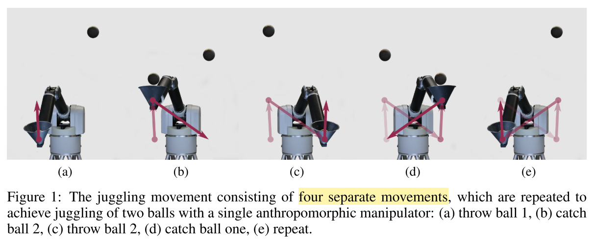 | 
|:--:| 
| *a **normal distribution** (`mu`,`co-var`) from which parameters are sampled at the start of each rollout. These parameters define the `4` switching points, called **`via-points`**, between the `4` juggling movements. A **`PD` controller** computes the torques to follow the **spline** fitted on these `4` `via-points`. [source](https://arxiv.org/abs/2010.13483)* |

| 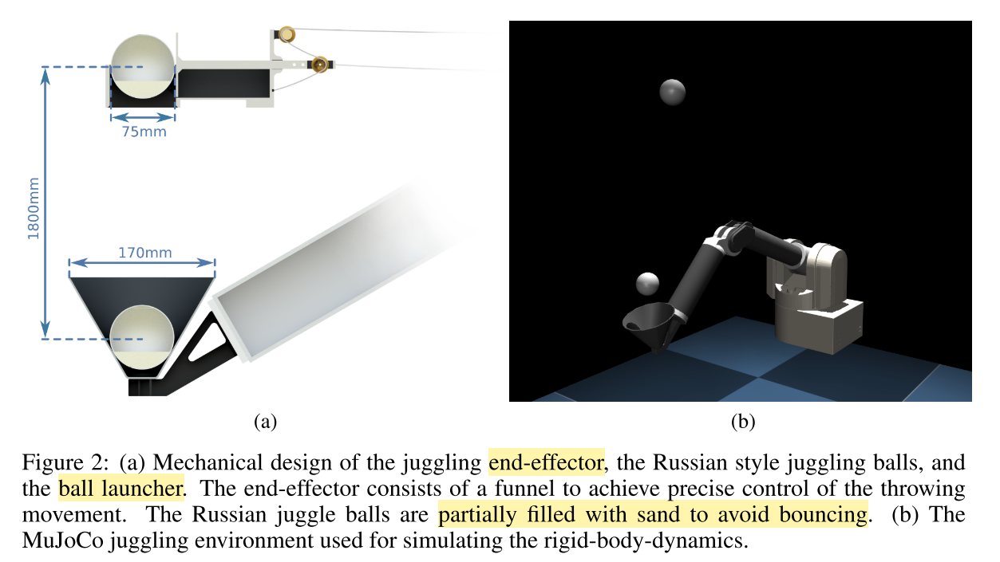 | 
|:--:| 
| *the **end-effector helps** to passively compensate for minor differences in ball trajectories. [source](https://arxiv.org/abs/2010.13483)* |

| 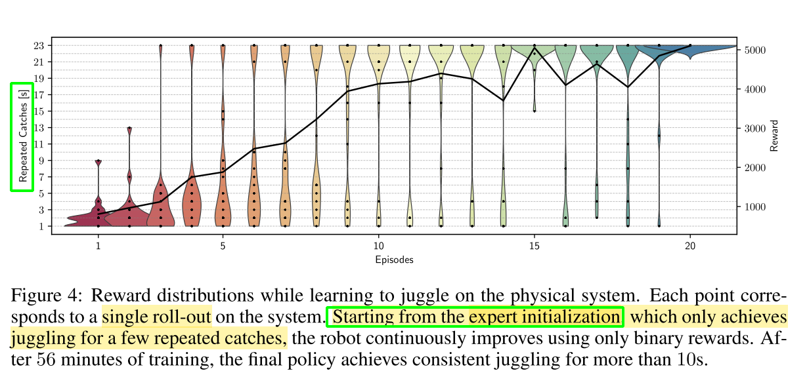 | 
|:--:| 
| *the **initialization** of the `via-points` is key (since the **`reward` is sparse**) and requires **hand-tuning** and **engineering**. [source](https://arxiv.org/abs/2010.13483)* |

| 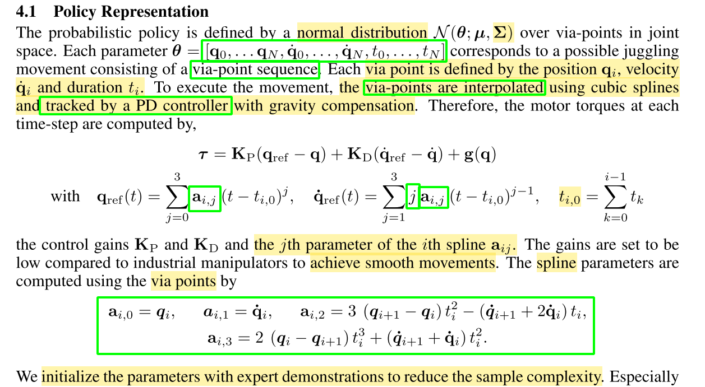 | 
|:--:| 
| *__one-step `MDP`__: the current `mu`, `co-var` define a `Normal` distribution. Parameters are sampled to **generated the `4` via-points**. A **spline** is fitted. A **`PD` controller** tracks this trajectory. [source](https://arxiv.org/abs/2010.13483)* |

_RL?_
- **one-step** MDP
- **no interaction** with the environment
- **no `observation`!!**
- > "This framing is identical to a **bandit setting** with high-dimensional and continuous `actions`"
- _to me_:
  - a **control problem**, where
    - **initial parameters** are already good (manually tuned)
    - **parameters are optimized** with a complex search procedure

task
- `2`-ball juggling
- high accelerations required: of up to `8 g`
- [historic overview of robot juggling](https://www.youtube.com/watch?v=2ZfaADDlH4w)

hw
- [Barrett WAM manipulator](https://advanced.barrett.com/wam-arm-1)
  - `4`-DoF
  - **no simulation** possible:
    - > "For the **tendon driven** `Barrett WAM`, rigid-body-simulators also cannot model the **dominating cable dynamics** at high accelerations"
- [`optitrack`](https://optitrack.com/) ball tracker
  - not perfect though:
  - > "we had a hard time achieving good tracking performance during the experiments due to the wear and tear on the reflective tape and the frequent occlusions"
- juggling balls
  - `75 mm`
  - [Russian style](https://juggle.fandom.com/wiki/Russian_style_juggling_balls):
    - hollow plastic shell: **do not deform**
    - partially filled with `37.5 g` of sand: **do not bounce**
- end-effector designed to make the task **robust**
  - the **funnel-shaped** end-effector passively compensates for minor differences in ball trajectories

ideas
- **before** the episode
  - define a **normal distribution** from the current estimated `mu` and `co-var` (**multivariate**)
  - **sample parameters** to define **`4` "via-points"**
  - note: this is the only time in the episode that `actions` are taken (afterwards **open-loop tracking** control)
  - compute a **cubic spline** from them (interpolation)
- in **transient state** = **stroke-based** movement
  - initial **stroke movement** that quickly enters the limit cycle without dropping a ball
    - ???
    - **hand-tuned**
  - the second ball is released via a launching mechanism `3 m` above the floor (`1.8 m` on `fig.2`)
- in **steady state**:
  - keep tracking this spline (interpolated via-points) with a **`PD` controller** with **gravity compensation**
  - terminate on a ball fall
  - truncation after `10 s` juggle
- after the episode
  - estimate performance with **binary `reward`** (sparse):
    - `+1` each time one ball reaches `60 cm`
- after `20` episodes:
  - optimize the **parameters distribution** and repeat

_how many trials?_
- `500` rollouts:
  - `25` randomly sampled parameters executed per "episode"
  - `20` "episodes"
- `56 min` of **experience**
- the **learning** still takes **up to `5 h`**

open-loop
- `closed-loop` is difficult:
  - **noisy ball observation** and potential **outliers** might **cause instabilities**
- human can do `open-loop`:
  - > "well trained jugglers can juggle basic patterns **blindfolded**"

`via point` parameters used to define a **cubic spline**
- position `qi`
- velocity `q˙i`
  - enforced to be `0` (which reduces the dimensionality)
- duration `ti`

safety
- safer to **predict** a trajectory, rather than **torques**
  - **tight box constraints** in **joint space** are enforced for the desired trajectory
  - against **self-collisions** and hitting the **joint limits**

**`policy` (parameter distribution) initialization**
- **expert** initialization
- **engineering required!**
- initially the robot on average achieves **between `1` to `3` repeated catches**
- **`via-points` are manually initialized**
  - advantage: they are **interpretable**
  - > "tuning the **stroke-based movement** is the hardest part of the manual parameter tuning"

policy optimizer
- information-theoretic policy search approach
  - **_episodic Relative Entropy Policy Search_ (`eREPS`)**
- quite complex!
- > "We use `eREPS` instead of `EM-based` or `gradient-based` policy search as the **`KL` constraint** prevents premature convergence and **large, possibly unsafe, jumps** of the `policy` mean"

sparse rewards
- the **delay** between `action` and `reward`, i.e., **"credit assignment"**, is a challenge:
  - a **bad `action`** within the throwing will cause a drop, i.e. `reward = 0`, **seconds after the `action`**
- requires a **very good `policy` initialization!**

</details>

---

**`"Excavation Reinforcement Learning Using Geometric Representation"`**

- **[** `2022` **]**
  **[[:memo:](https://www.semanticscholar.org/paper/Excavation-Reinforcement-Learning-Using-Geometric-Lu-Zhu/f3bad843e86a37dd29e86ef5582eced26c82e028)]**
  **[[🎞️](https://drive.google.com/drive/folders/19n-V573He55i6WqnoINukvoaU1oqSUmQ)]**
- **[** _`1-step`, `franka emika`_ **]**

<details>
  <summary>Click to expand</summary>

|  | 
|:--:| 
| *description [source](https://drive.google.com/drive/folders/1rx1mcAEe8eVNy8omeNM3R794tgZ2rDBf)* |

| 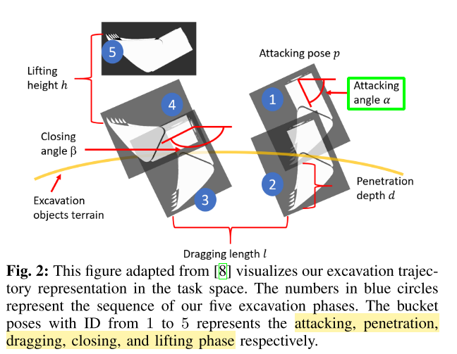 | 
|:--:| 
| *`action`: the excavation trajectory `T` is simplified to its **attacking pose**: (`x`, `y`, `α`) [source](https://drive.google.com/drive/folders/1rx1mcAEe8eVNy8omeNM3R794tgZ2rDBf)* |

| 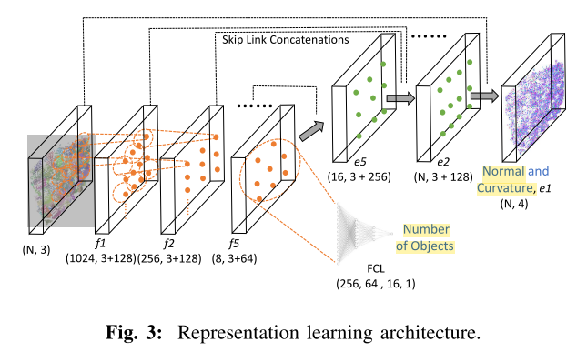 | 
|:--:| 
| *`state`: feature extraction is done before the `RL`: predict the `normal`, `curvature`, and the `number of objects` in the digging tray [source](https://drive.google.com/drive/folders/1rx1mcAEe8eVNy8omeNM3R794tgZ2rDBf)* |

motivations:

- long-term goal
  - maximize the accumulative volume of the excavated rigid objects
  - plan N digging trajectories, not just one excavation
- learn a `280-dim` geometric representation for point clouds, which allows us to use a small policy network
  - based on PointNet++
  - in: point cloud
  - out: its normal, curvature, and the number of objects in the digging tray

excavation
- `attacking`
- `digging`
- `dragging`
- `closing`
- `lifting`
- we **simplify** the excavation trajectory `T` as its **attacking pose**: (`x`, `y`, `α`), which we also refer to as the **attacking pose**
  - **the other parameters (`dragging length`, `lifting h`, `closing angle`) are fixed**

real-world
- > "resistive force during rigid objects excavation can be large and only limited amount of force and torque can be applied by the Franka arm in real world"

</details>

---
---

# :books: theory & reviews

**`"Deep Reinforcement Learning with Real-World Data"`**

- **[** `2022` **]**
  **[[🎞️](https://www.youtube.com/watch?v=0Kw-VTym9Pg)]**
- **[** _`offline RL`, `data-driven RL`, `conservative Q-learning`_ **]**

<details>
  <summary>Click to expand</summary>

| 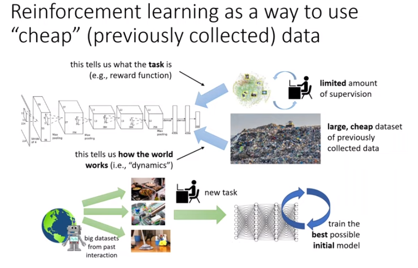 | 
|:--:| 
| *do not try to copy the garbage, rather try to **understand the `dynamics`**, i.e. the **consequences of decisions** [source](https://www.youtube.com/watch?v=0Kw-VTym9Pg)* |

| 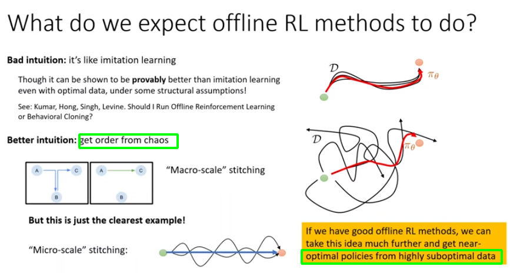 | 
|:--:| 
| *extract the **best parts** of **suboptimal demonstrations** [source](https://www.youtube.com/watch?v=0Kw-VTym9Pg)* |

| 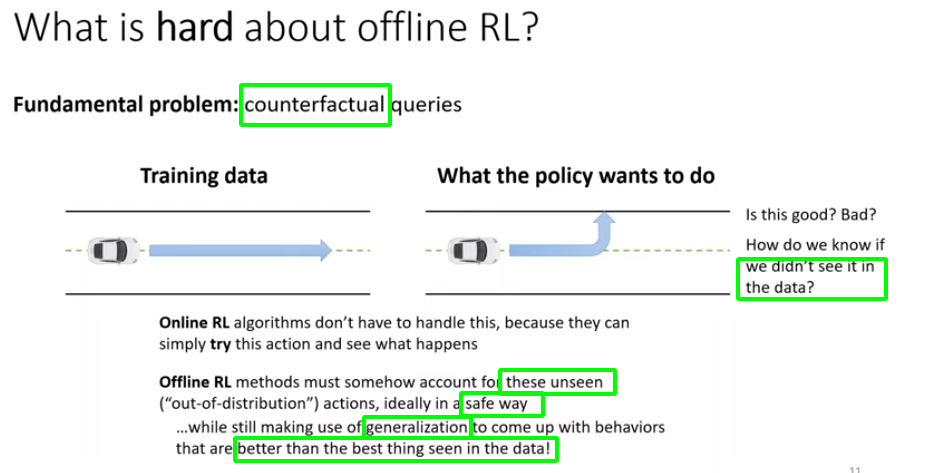 | 
|:--:| 
| *how to know if this is good if __you do see it__ in the data? it can be __dangerous__, but also __just better [source](https://www.youtube.com/watch?v=0Kw-VTym9Pg)* |

| 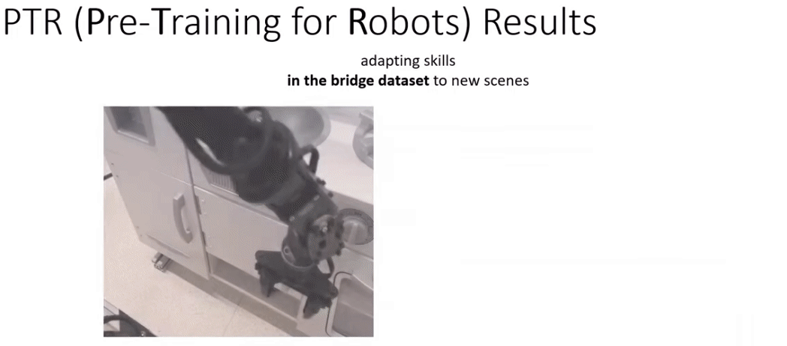 | 
|:--:| 
| *the big trained `PTR` can be used either for __fine-tuning__ or for initializing __new tasks__ [source](https://www.youtube.com/watch?v=0Kw-VTym9Pg)* |

additional resource
- [similar talk at GTC23](https://www.nvidia.com/en-us/on-demand/session/gtcspring23-s51826/)
- [`Imitation learning vs. offline reinforcement learning`](https://www.youtube.com/watch?v=sVPm7zOrBxM)
- [`Reinforcement Learning Pretraining for Reinforcement Learning Finetuning`](https://www.youtube.com/watch?v=zg6Tip6s_mA)
- [`Offline Reinforcement Learning: From Algorithms to Practical Challenges`](https://sites.google.com/view/offlinerltutorial-neurips2020/home)
- [Chelsea Finn's intervention in `Dexterity: Machine Learning for Robot Manipulation and Dexterity`](https://youtu.be/Vj50Z7az3TY?t=642)

**data-driven `RL`**
- as a way to use "large + cheap + garbage" data
- **do not to learn the `decision`**: _what to do?_
  - but rather **understand the `consequences`**: _how does the world work?_
  - understand the **world dynamics** from **suboptimal (w.r.t. our `task`) samples**
- then define a `task`
  - small supervised work: human-designed the `reward function`

`RL` vs `supervised-learning`
- about making **`decisions`** considering their consequences
  - not just `predictions` (learning `p(x)`) that ignore the **consequences**
- **active online** learning
  - require an interaction: `online` is costly
    - in a dialogue, you would have to talk to people in real-time

`offline RL` vs `IL`
- you do not want to **copy the garbage**
- rather **copy the best parts** of each suboptimal data, and **generalize**

issue with `offline RL`
- **counterfactual queries**
  - _"is it a good idea if I suddenly turn on the highway?"_, this **has not happened in the dataset** (out-of-distribution)
  - `online RL` could try
  - `offline RL` should, at the same time
    - **generalize** to get better than the data
    - **stay safe**
- `distributional shift`
  - apply naive `Q-learning` does not work
  - **over-estimation of `Q`**
    - predicted `Q-values` are huge
    - learnt `pi returns` are bad
  - it resembles **adversarial** example
    - ??
- sol: **`conservative Q-learning`**
  - detect where (which `action`) the `Q-value` is over-estimated compared to the current `Q-value`, and reduce it
  - a regularization similar to **adversarial** training process

applications: **few-shots**
- **fine-tuning** on task already present in the data
- **pre-training** (initialization) of down-stream tasks

[`PTR`: "Pre-Training for Robot"](https://sites.google.com/view/ptr-robotlearning)
- trained on [Bridge Data](https://sites.google.com/view/bridgedata)
- learn 1 `policy`, on all tasks (different domains)
  - conditioned with one-hot vector (task)
- **fine-tune** or **training** on a **new down-stream task**, while **preventing forgetting** (`batch-mixing`)

</details>

---

**`"Robot Learning from Randomized Simulations : A Review"`**

- **[** `2022` **]**
  **[[:memo:](https://arxiv.org/pdf/2111.00956.pdf)]**
  **[[🎞️](https://www.ias.informatik.tu-darmstadt.de/Videos/Videos)]**

- **[** _`domain gap`, `domain parameter distribution`, `domain randomization`, `sim2sim`, `sim2real`_ **]**

<details>
  <summary>Click to expand</summary>

| 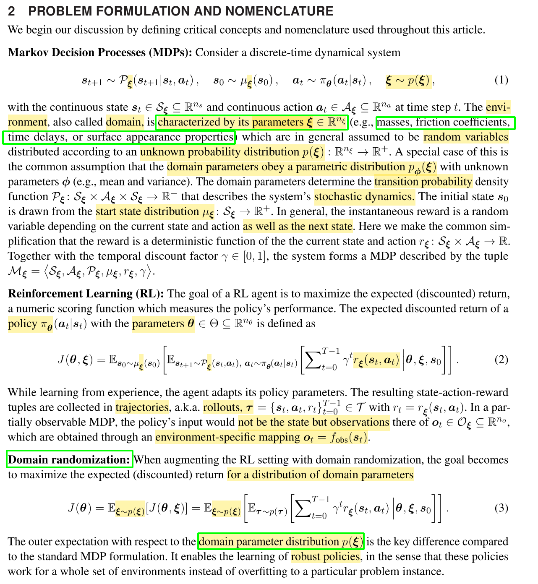 | 
|:--:| 
| *problem formulation: a `domain parameter distribution` `p`(`ξ`) is introduced [source](https://arxiv.org/pdf/2111.00956.pdf)* |

motivations:
- **`domain randomization`** is a method for learning from randomized simulations by **adding perturbation**
  - of simulator parameters
  - state `observations`
  - or applied `actions`
- it can be seen as a **regularization method** that prevents the learner from **overfitting** to individual **simulation instances**
  - from the **Bayesian perspective**, we can interpret the `distribution over simulators` as a representation of **uncertainty**
- ideally, measure for the inter-domain transferability of controllers

example of parameters:
- bodies' inertia and geometry
- parameters of the **friction** and **contact** models
- possible **delays in the actuation**
- efficiency coefficients of motors
- levels of **sensor noise**
- visual properties (colors, illumination, position and orientation of a camera)

why a gap?
- some physical phenomena are omitted,  especially `friction`
- parameter estimation is inaccurate, which can quickly lead to unstable system dynamics
- the numerical integration is discrete in typical solvers

**physic engines**
- = `parameterized generative models`, which describe how multiple bodies or particles evolve over time by interacting with each other
  - the associated `physics parameters` can be estimated by `system identification`
    - which generally involves executing experiments on the physical platform and recording associated measurement
  - > "It is important to keep in mind that even if the `domain parameters` have been **identified very accurately**, simulators are nevertheless just **approximations of the real world** and are thus always imperfect"
  - strength: simulators are able to **model the control and kinematics** accurately
  - weakness: show deficits during **dynamic robot-object interactions**
- sources of deviations between physics engines
  - **`friction` models**
  - **`contact` models**
  - coordinate representations
  - numerical solvers
- examples
  - `ODE`
  - `DART`
  - `Bullet`
  - `MuJoCo`
  - `PhysX` (nvidia)
  - `FleX` (nvidia)
  - `Newton`
  - `SimBody`
  - `Vortex`
  - `Havok`
  - `Chrono`
  - `RaiSim`
  - `Brax`

randomization
- _which param?_
  - first identify the essential parameters
  - injecting **random latency** and *noise to the actuation** is another frequent modeling choice
  - including at least one **visually observable parameter** (e.g., an extent of a body) helps to **verify if the values are set as expected**
- _when?_
  - sample parameters at **each `episode`** _(not at each `step`!)_
- physical plausibility
  - `DR` can cause **numerical instabilities**
- good practice
  - test an `DR` on **at least two different `sim-to-real` tasks**
- three types of `DR`
  - **static**
    - a set of `domain parameters` is sampled at each episode
    - requires **hand-tuning** the `domain parameter distribution`
    - variation: randomizing dynamics using real-world data at runtime
      - incorporate the **simulator** as a prior for the **probabilistic model**, and subsequently use this information of the **`policy` updates** with `PILCO`
  - **adaptive**
    - a set of `domain parameters` is sampled at each episode
    - the `domain parameter distribution` is **updated during learning**
    - requires **data from the `target domain`**, typically the real robot, which is expensive
    - variation: `pi`(`obs`, `ξ`), the `policy` is **conditioned** on the **`state`** and the **`domain parameters`**
      - parameters are not assumed to be known, they have to be estimated
      - the **online system identification** module can enable an **adaption to sudden changes** in the environment
    - variation: `bilevel` optimization
      - `SimOpt`
      - `BayRL`
        - an `upper` level problem: find the `domain params` that lead to a `policy` with maximal **real-world `return`**
        - a `lower` level problem: find a `policy` in the **current** randomized `source` domain
  - **adversarial**
    - apply **adversarial disturbances** during the training process
    - too much disturbance can make the task unsolvable
    - variation (`zero-sum game`): the `model-player` agent hinders the `policy-player` agent from fulfilling its task by applying force disturbances at predefined locations

promising directions
- `real-to-sim-to-real` transfer
  - reduce workload
  - bring a meaningful initialization for `domain distribution parameters`
- pair the expressiveness of deep `NN` with **physically-grounded prior** knowledge
- hierarchical `RL`
  - tasks consist of (disconnected) segments
    - e.g. a robot needs to _turn the knob_ before it can _open a door_
  - sol: splitting the control into `high` and `low` level policies, similar to the **`options` framework**
  - > "Existing approaches typically realize this with **discrete switches** between the **low-level policies**, leading to undesirable abrupt changes in the behavior"

other concepts
- `curriculum learning`gap
  - > to increase the **sample efficiency** by **scheduling** the training process such that the agent first encounters **"easier" tasks** and gradually progresses to **"harder"** ones.
  - `curriculum learning` **does not aim** at finding solutions **robust to model uncertainty**
- `meta learning`
  - one can view `domain randomization` as a special form of `meta learning` where the robot's **task remains qualitatively unchanged** but the **environment varies**
  - but actually different
    - The goal of `meta learning` is to **find a suitable set of initial weights**, which when updated generalizes well to a new task
    - `domain randomization` on the other hand strives to directly **solve a single task**, generalizing over `domain` instances
- `transfer learning`
  - `DR`: case of `TL` where
    - ground truth information is only available in the `target domain`
    - `target domain` different from `source domain`
    - the task remains the same
- `knowledge distillation`
  - `KD` can be used to **compress the learned behavior** of one or more **teachers** into **a single student**
  - Based on samples generated by the **teachers**, the **student** is trained in a **supervised manner** to **imitate** them
- `system identification`
  - The goal is to find the set of **model parameters** which **fit the observed data best**
  - simple linear regression: it was quickly observed that the inferred parameters may be **physically implausible**

</details>

---

**`"Time limits in reinforcement learning"`**

- **[** `2022` **]**
  **[[:memo:](https://arxiv.org/pdf/1712.00378.pdf)]**
  **[[🎞️](https://www.youtube.com/watch?v=UUqidOSMKLE)]**
  **[[🎞️](https://fabiopardo.github.io/posters/time_limits_in_rl.pdf)]**
  **[[🎞️](https://sites.google.com/view/time-limits-in-rl)]**
- **[** _`Markov`, `time-awareness`, `truncation`, `termination`, `bootstrappig`, `episode`, `gymnasium`_ **]**

<details>
  <summary>Click to expand</summary>

|  | 
|:--:| 
| *The `infinite cube pusher` task [source](https://youtu.be/ckgVLgFi-sc?t=56)* |

| 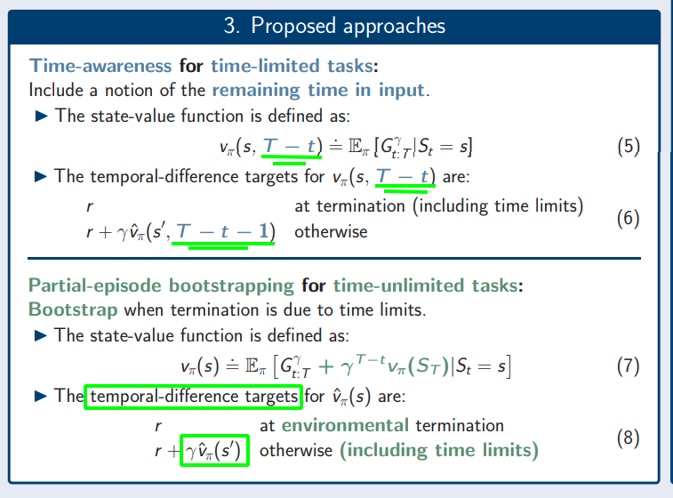 | 
|:--:| 
| *in __`episodic`__ task, add `remaining-time` to `obs` // in __`non-episodic`__ task, make them `episodic` to __increase exploration__, but make sure to __boostrap when `truncating`__ to let the agent know that __more `rewards` would actually be available__ thereafter [source](https://arxiv.org/abs/1712.00378)* |

| 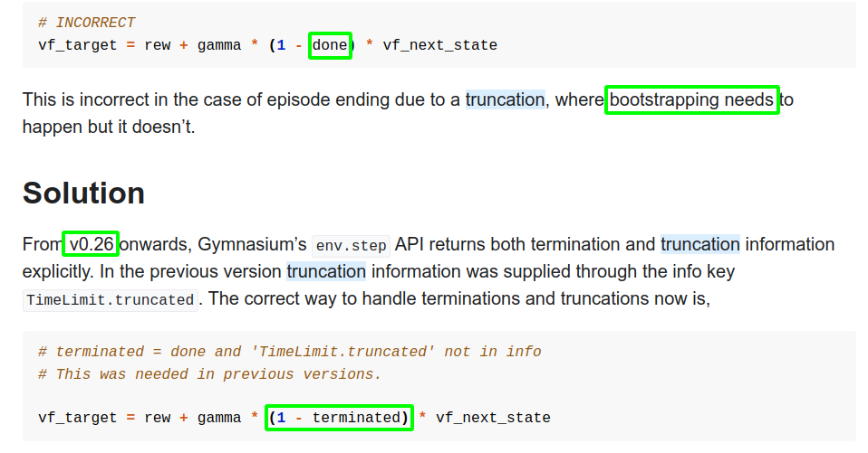 | 
|:--:| 
| *`gymnasium` approach: distinguish `MDP`-`termination` and external-`truncation` [source](https://gymnasium.farama.org/tutorials/gymnasium_basics/handling_time_limits)* |

ideas
- especially for `bootstrapping` methods 
- [`episodic` task]
  - respect Markov
  - add `remaining time` to `observation`
- [`time-unlimited` task]
  - make it `episodic` (`timeout`) **during training** to help exploration
  - but be careful: [`timeout` termination] `!=` [`env` (`MDP`) termination]
  - therefore: `bootstrap` at `states` where `termination` is due to **time limits**

note:
- `bootstrapping` = using **estimated values** of `V[s+1]` to update the **estimate** of the `V[s]`

case1: **time-_limited_** tasks
- i.e. "episodic"
  - the _maximum length_ of an episode is fixed
- possible issues:
  - **`state aliasing`**, i.e. unperceived remaining time
    - a time-**unaware** agent has to act in a `POMDP` where `states` (that only differ by their **remaining time**) appear identical
    - perception of **non-stationarity** of the `env`: the `terminations` due to **time limits** can only be **interpreted** as part of the **`env`'s stochasticity**
    - infeasibility of correct **`credit assignment`**: **conflicting updates** for estimating the *`value` of the same `state`* result in an inaccurate average
    - suboptimal policies and **instability**
    - "out-of-reach cells leaking" (when `bootstrapping` `values` from `states` that were **out-of-reach**): letting the agent **falsely believe** that more `rewards` were available after
- solution: **`time-awareness`** (`TA`)
  - add a notion of the `remaining time` to the `observation`, to avoid violation of the **`Markov` property**
  - learn to take **more risky** actions leading to higher expected returns as **approaching the time limit**

case2: **time-_unlimited_** tasks
- indefinite period, possibly infinite
  - no underlying `episodic` structure
  - e.g. `Hopper-v1` / `highway`
- `exploration` requires sufficiently **randomized initial `states`**
  - therefore, **"partial episodes"**
    - frequently `reset` the `env` to **diversify experiences**
    - introduce `truncations` to learn from **time-limited interactions**
  - but: the `time limits` are not part of the `env` and are **only used to facilitate learning**
- idea/solution: **differentiate** between the types of `terminations`
  - those from the `env` (e.g. `off-road`)
    - do not boostrap!
  - those due to `time limits` (`truncation` in `gymnasium`)
    - boostrap
    - `partial-episode bootstrapping` (`PEB`)
    - otherwise: **forgetting** that more `rewards` would actually be available thereafter
- note: `PEB` helps large `experience replay buffers`

[open question](https://youtu.be/UUqidOSMKLE?t=594) by Richard Sutton I guess:
- `partial-episode bootstrapping` makes `on-policy` methods `off-policy`
  - because the applied bootstrap (at `truncation`) uses estimates that **may not come from the current policy**
  - _how to deal with that?_

why do common **`time-unaware` agents** still often manage to perform relatively well?
- if **`time limits` are so long** that timeouts are hardly ever experienced
- if there are **clues in the `observations`** that are **correlated with time** (e.g. the `forward distance`)
- if it is **not likely** to observe the **same `states` at different remaining times**
- if the **`discount factor` is sufficiently small** to reduce the impact of the **confusion**

[`gymnasium` approach](https://gymnasium.farama.org/tutorials/gymnasium_basics/handling_time_limits)
- in old `gym`, **time limits** are incorrectly handled
  - > "The `done` signal received (in previous versions of OpenAI Gym < 0.26) from `env.step` indicated whether an **episode has ended**. However, this `done` signal did not distinguish whether the `episode` ended due to **`termination` or `truncation`**"
- new `gymnasium` distinguishes
  - `termination` = `MDP` end
    - **terminal `states`** are defined as part of the **`env` definition**
    - task `success`, task `failure`, robot falling down, etc.
    - [in `finite-horizon` `env`]
      - episodes ending due to **a time-limit inherent to the `env`**
      - here the `remaining time` should be added to the `observation`
  - **`truncation` = external interruption**
    - not defined by the `MDP`
      - e.g. **time-limit**, a robot going **out of bounds**
    - [`infinite-horizon` `env`]
      - `truncation` is needed
      - > "We cannot **wait forever** for the **episode to complete**, so we set a **practical time-limit** after which we forcibly halt the episode."

</details>

---

**`"Curriculum Learning for Reinforcement Learning Domains: A Framework and Survey"`**

- **[[:memo:](https://arxiv.org/pdf/2003.04960.pdf)]**
- **[** _`todo`, `curriculum learning`_ **]**

<details>
  <summary>Click to expand</summary>

todo

|  | 
|:--:| 
| *todo [source](https://arxiv.org/pdf/2003.04960.pdf)* |

</details>

---
---

# :yum: other good resources

<details>
  <summary>Click to expand</summary>

## papers

[`Learning to Walk in Minutes Using Massively Parallel Deep Reinforcement Learning`](https://leggedrobotics.github.io/legged_gym/)
- training the quadruped `ANYmal` robot in `Isaac Gym`
- [presentation](https://www.youtube.com/watch?v=Afi17BnSuBM)

[`Intelligent Autonomous Systems - TU Darmstadt`](https://www.ias.informatik.tu-darmstadt.de/Videos/Videos)

[OpenAI](https://www.youtube.com/playlist?list=PLOXw6I10VTv_CcTXlvHmGbWH-_wUOoRoO)

[`CoRL`](https://corl2022.org/previous-conferences/)

## sim

[`nvidia Isaac Orbit`](https://isaac-orbit.github.io/orbit/source/tutorials_envs/00_gym_env.html)

[`isaac gym`](https://docs.omniverse.nvidia.com/app_isaacsim/app_isaacsim/tutorial_gym_isaac_gym.html)
- [`OmniIsaacGymEnvs`](https://github.com/NVIDIA-Omniverse/OmniIsaacGymEnvs)

[`SimuRLacra`](https://github.com/famura/SimuRLacra)

## lectures

[`CS285 Deep Reinforcement Learning`](https://rail.eecs.berkeley.edu/deeprlcourse/)

[`CS287 Advanced Robotics at UC Berkeley Fall 2019`](https://www.youtube.com/playlist?list=PLwRJQ4m4UJjNBPJdt8WamRAt4XKc639wF)

## good practice

finding and executing RL project
- [`winder.ai 1`](https://winder.ai/rl-presentation-finding-and-executing-reinforcement-learning-projects/)
- [`winder.ai 2`](https://winder.ai/rl-presentation-how-to-overcome-reinforcement-learning-challenges/)

[`RL in practice: tips & tricks`](https://www.youtube.com/watch?v=Ikngt0_DXJg)
- about concrete considerations when learning on real robots
- [slides](https://araffin.github.io/slides/rlvs-tips-tricks/)

[`Nuts and Bolts of Deep RL Experimentation`](https://www.youtube.com/watch?v=8EcdaCk9KaQ)

[`Deep Reinforcement Learning Doesn't Work Yet`](https://www.alexirpan.com/2018/02/14/rl-hard.html)

</details>
